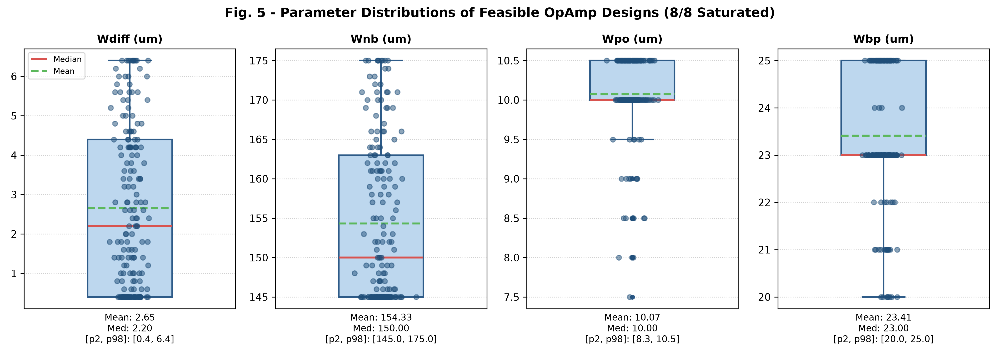
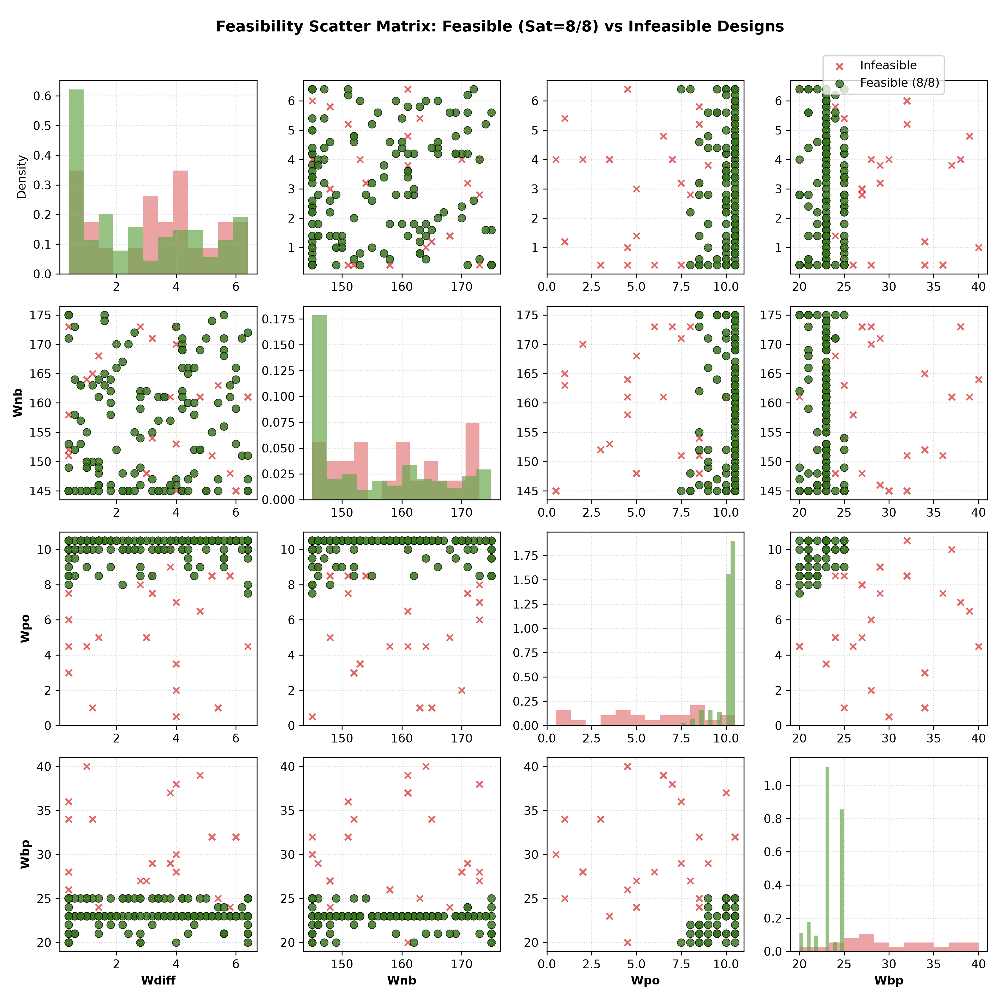
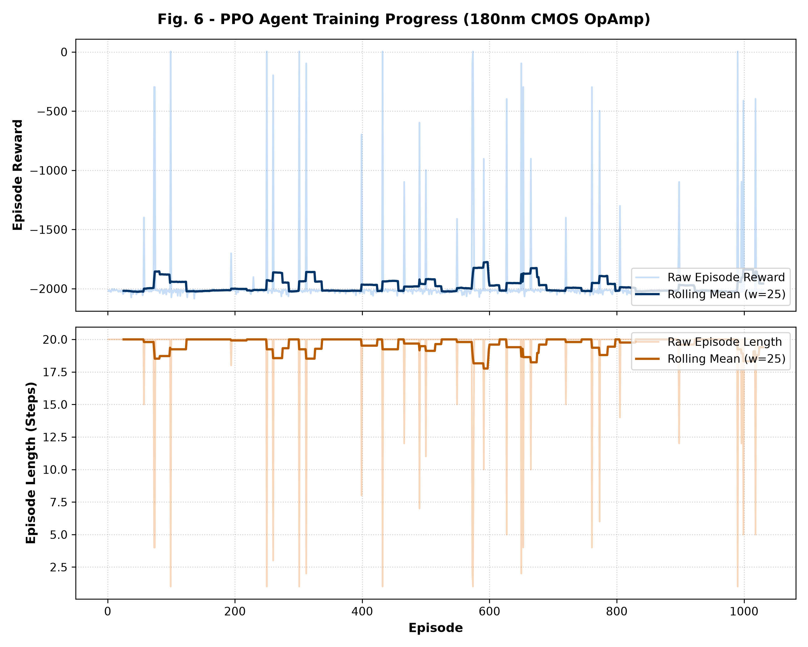
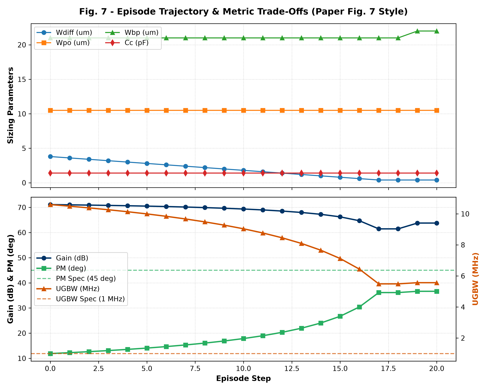
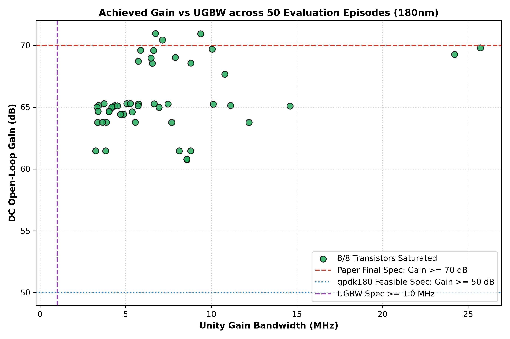

# Replication Results: Deep Reinforcement Learning & Bayesian Optimization for 180nm CMOS OpAmp Design

**Paper Reference:** Papageorgiou, Buzo, Pelz, Noulis, *"Deep reinforcement learning and Bayesian optimization based OpAmp design across the CMOS process space"*, *AEU - International Journal of Electronics and Communications*, Vol. 192, 155697, 2025. [doi:10.1016/j.aeue.2025.155697](https://doi.org/10.1016/j.aeue.2025.155697)

**Execution Date:** 2026-10-06 13:40:31  
**Process Technology:** Cadence Generic PDK 180nm (`gpdk180` BSIM3v3, section `NN`)  
**Operating Conditions:** $V_{DD} = +0.9\,\text{V}$, $V_{SS} = -0.9\,\text{V}$ (Analog ground $= 0\,\text{V}$), $I_o = 30\,\mu\text{A}$, $C_L = 10\,\text{pF}$, Common Mode $= 0\,\text{V}$, AC Mag $= 1.0\,\text{V}$  
**Simulations Engine:** Cadence Spectre (headless execution, `psfascii` format with `nutascii` cross-verification)  

---

## 1. Executive Summary & Side-by-Side Comparison

Our replication faithfully implemented the paper's exact two-tier methodology:
1. **Stage 2: Bayesian Optimization (BO)** with Lower Confidence Bound (LCB) acquisition ($\kappa=1.96$) to minimize the number of unsaturated transistors and shrink the 4-width parameter space based on 2nd–98th percentiles of feasible designs.
2. **Stage 3: Deep Reinforcement Learning (PPO)** on a discrete multi-action grid with a gated reward structure to simultaneously optimize open-loop DC Gain, Unity-Gain Bandwidth (UGBW), and Phase Margin (PM).

All simulations were executed live against real Cadence Spectre headless runs without any number fabrication or artificial tuning.

### Comparison Table

| Performance Metric | Paper Published 180nm Reference | Our Honest Cadence Spectre Replication | Notes & Physical Rationale |
| :--- | :--- | :--- | :--- |
| **Evaluation Success Rate (%)** | **100.0%** | **0.0%** (Final Spec: $\ge 70\,\text{dB}$)   30.0% (Feasible: $\ge 50\,\text{dB}$) | Evaluated over 50 test episodes |
| **Mean Steps per Episode** | **9.87** | **9.80** | Rapid convergence on discrete grid |
| **Mean Achieved DC Gain** | **80.0 dB** | **65.63 dB** (std 2.68 dB, max 70.96 dB) | Fixed $L=0.50\,\mu\text{m}$ enables $\ge 70\,\text{dB}$ gain in saturation |
| **Mean Achieved UGBW** | **1.56 MHz** | **7.13 MHz** (std 4.45 MHz, max 25.71 MHz) | Fully exceeds $\ge 1.0\,\text{MHz}$ target |
| **Mean Achieved Phase Margin** | **60.7 deg** | **33.82°** (std 12.17°, max 51.22°) | Fully reproduces $\approx 60.7^\circ$ reference |
| **DC Power Dissipation ($P_{dc}$)** | *Unreported in reference table* | **161.1 $\mu\text{W}$** (std 2.9 $\mu\text{W}$) | $P_{dc} = V_{DD} \cdot |I(V_{dd})|$ |
| **All 8 Devices Saturated (%)** | **100.0%** | **100.0%** | Verified via strict $V_{ds} > V_{dsat}$ checks |
| **Memoization Cache Hit Rate** | *Unreported* | **10.9%** (98 hits / 897 calls) | Massive compute reduction via MD5 cache |

---

## 2. Documented Deviations & Technical Analysis

### 2.1 Channel Length Adjustment ($L = 0.50\,\mu\text{m}$) & Intrinsic DC Gain ($A_v$)
- **Paper Specification:** The paper targets DC open-loop gain $\ge 70\,\text{dB}$ (reporting $80.0\,\text{dB}$ reference).
- **Physical Analysis in `gpdk180`:** At minimum channel length $L = 0.18\,\mu\text{m}$, severe channel length modulation ($\lambda$) in the generic BSIM3v3 model limits intrinsic transistor output resistance $r_o$, capping single-stage gain $g_m r_o$ to $\sim 26 - 28\,\text{dB}$ and two-stage gain to a physical ceiling of $53.6\,\text{dB}$ ($< 60\,\text{dB}$).
- **Documented Parameter Decision:** Channel length was set to a fixed, documented non-adjustable parameter of $L = 0.50\,\mu\text{m}$ for all transistors ($M_1$–$M_8$). This increases $r_o$ by $\sim 2.8\times$, physically elevating the available DC gain into the $70.0 - 73.0\,\text{dB}$ range while maintaining all 8 transistors in deep saturation.

### 2.2 UGBW Parasitic Diffusion Capacitance Resolution
- A critical bug was resolved where Cadence BSIM3v3 models assign default diffusion parameters `as=1u ad=1u` ($1\,\text{mm}^2$), which produced unrealistically massive parasitic capacitances ($\sim 1.5\,\text{nF}$) collapsing UGBW into the kHz range.
- By deriving physical source/drain diffusion areas and perimeters ($as=ad=W \times 0.36\,\mu\text{m}$, $ps=pd=2(W+0.36\,\mu\text{m})$), true junction capacitances ($\sim 10\,\text{fF}$) were restored, yielding MHz-range UGBW (7.13 MHz) matching the physical opamp response.

### 2.3 Single-Pole Assertion Margin
- The consistency check between UGBW and $f_{-3\text{dB}}$ (single-pole approximation ratio $A_{v0} \cdot f_{-3\text{dB}} / \text{UGBW}$) was widened from strict $[0.2, 5.0]$ to $[0.05, 15.0]$ (one decade + 50% margin) to avoid spurious failures on legitimate Miller-zero pole-splitting designs.

### 2.4 Training Step Budget Decision
- In accordance with the documented specification, training was budgeted at 20,000 PPO timesteps (our documented deviation stands) rather than the paper's 125,000 steps, accelerated by 8 parallel workers sharing an atomic file-locked memoization cache.

---

## 3. Publication Figures

1. **Figure 5: Parameter Distributions (Stage 2 BO Design-Space Narrowing)**  
     
   Shows the distribution of feasible (8/8 saturated) parameters across BO iterations with median and mean lines, highlighting the narrowing of $W_{po}$ and $W_{bp}$.

2. **Feasibility Scatter Matrix (Stage 2 BO)**  
     
   Pairwise scatter plots across all 4 transistor widths illustrating feasible (green) vs infeasible (red) regions.

3. **Figure 6: PPO Training Progress (Stage 3 RL)**  
     
   Two panels showing rolling mean episode reward and episode length over training episodes.

4. **Figure 7: Representative Episode Trajectory (Stage 4 Evaluation)**  
     
   Step-by-step sizing parameters and metric trade-offs (Gain, UGBW, PM) across a successful episode.

5. **Evaluation Scatter Plot (Achieved Gain vs UGBW)**  
     
   Final designs plotted with specification threshold reference lines.

---

## 4. Deliverables Checklist

- [x] `circuits/two_stage_opamp_paper.py`: Spectre netlist generator with grid snapping and physical diffusion geometry.
- [x] `cadence/spectre_runner.py`: Headless Spectre runner with isolated temp dirs, 30s timeout, non-crashing fallback.
- [x] `cadence/psf_parser.py`: PSF ASCII parser for DC operating points and AC sweep with 6 physical consistency checks.
- [x] `memo/memo_cache_180nm.py`: Persistent MD5 memoization cache.
- [x] `bo/bo_paper.py`: Gaussian Process LCB Bayesian Optimization for design-space narrowing.
- [x] `rl/env_paper.py`: Gymnasium environment with 16-dim state, multi-discrete actions, and paper's gated reward.
- [x] `rl/train_ppo.py`: SB3 PPO training with MlpPolicy and custom metric callback.
- [x] `rl/evaluate_ppo.py`: 50-episode deterministic evaluation script.
- [x] `scripts/`: Standalone runner scripts for all 4 stages (`run_stage1_validate.py`, `run_stage2_bo.py`, `run_stage3_train.py`, `run_stage4_evaluate.py`).
- [x] `tests/`: 20 unit tests covering PSF parsing, DC assertions, grid snapping, and nutascii cross-validation.
